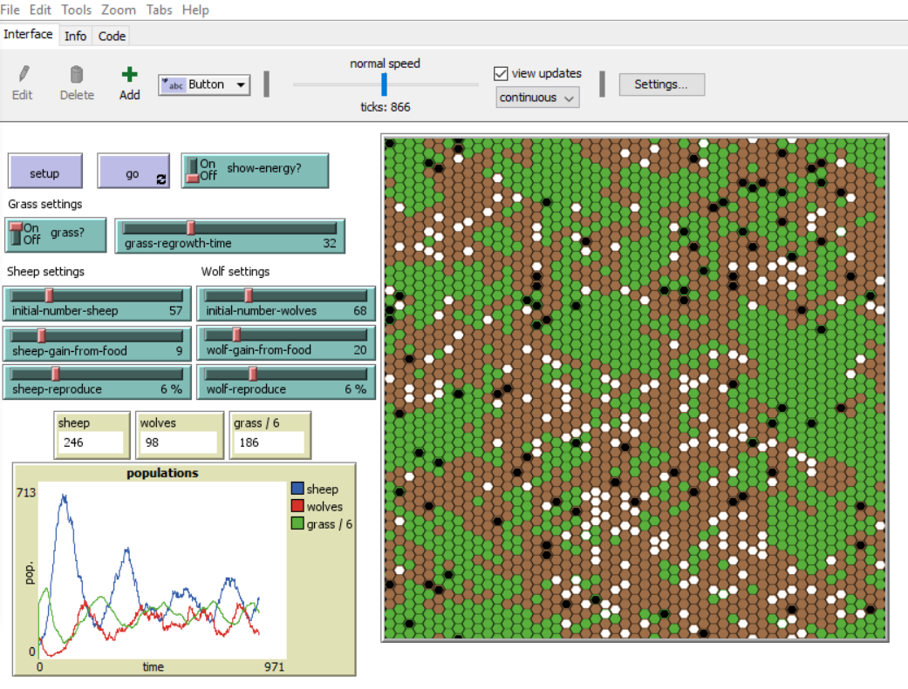

tl;dr: Download and install [NetLogo](https://ccl.northwestern.edu/netlogo/), download wolfsheephex.nlogo and open it with NetLogo, then click "setup" and then "go". Adjust the green settings to explore which model parameters tend to result in stable population cycles and which tend to result in eventual ecosystem collapse.

# Agent-based model of wolf-sheep predation on a hex map.
This program combines NetLogo's built-in Wolf Sheep Predation model and NetLogo's Hex Cells code example to create a wolf-sheep predation model that generates population curves that are closer in shape to the curves produced by Lotka–Volterra "predator-prey" equations than does NetLogo's built-in Wolf Sheep Predation model. (The patterns of grass consumption also have a more "natural" look.) I built this model because I suspected that random agent motion on a hex map would be a more realistic model parameter than random motion on a tradtional grid. Though the raw data might seem to validate my hypothesis, my model also uses a different random-direction-selection procedure than the orignal. That or some other programming choice I haven't examined might also explain the difference in outputs.

The source models I started with come preinstalled with NetLogo:
* Models Library -> Code Examples -> Hex Cells Example
* Models Library -> Sample Models -> Biology -> Wolf Sheep Predation, then change the model-version setting from sheep-wolves to sheep-wolves-grass

## todo
* The code comments need review and the built-in "Info" tab documentation has not been modified in any way.
* The built-in version of the model is about 3 times faster than my version.